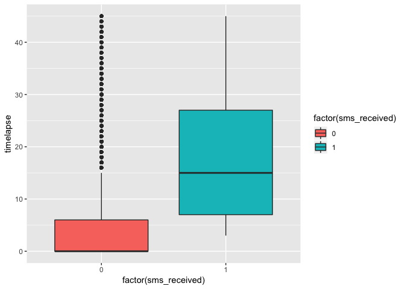
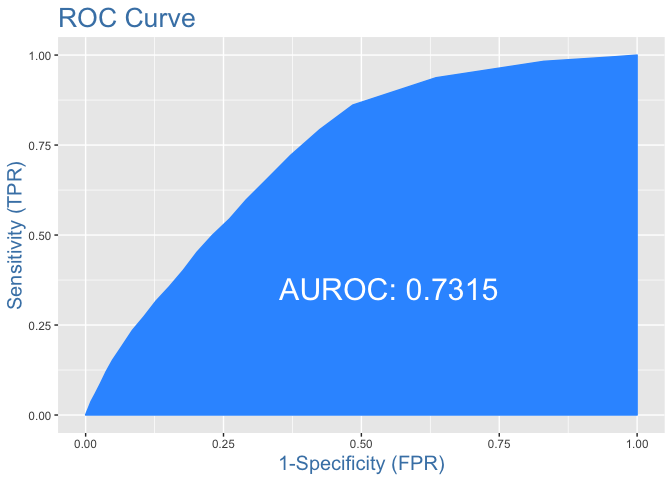

# MedicalNoShow

This is an Exploratory Data Analysis for [Medical Appointment no shows](https://www.kaggle.com/joniarroba/noshowappointments).

This dataset collects information from 100k medical appointments in Brazil. I want to study the relationship between outcome variable, `noshow` with rest of the predictors to understand if there are any pattern that correlates with no-show rate.

*Conclusion* This dataset reinforce the conclusion of previous research paper that `Timelapse` and `Age` variable are most important in predicting no-show rate. Interesting fact is, Brazil health care system seem to penalize those who have assess to cellphone. 

People who received sms notification tend to wait longer for see the doctor, longer time-lapse [calculated from `Appointment day - Schedule day`] are associated with higher no-show rate. Thus, even though an individual patient who received sms notification with a given timelapse day will tend to have lower probability of no-show rate than a patient who did not received sms notification with same wait, the fact that sms receivers on the whole tend to have higher wait time means that overall, sms receivers tend to have higher no show rate than non-sms receiver. 

This is an important distinction for medical company who is trying to figure out what type of patient are more likely to no-show. 

**A sms_receiver is more likely to not show up than non-sms receiver if no information about number of wait day is available. However, that patient is more likely to show up than the same patient with same wait day but did not received sms notification**

``` r
cor(strain$timelapse, strain$sms_received)
```

    ## [1] 0.4645512
    



Variables:

- patientid
- appointmentid
- gender
- schedule day
- appointment day
- age
- neighborhood
- scholarship
- hipertension
- diabetes
- alcoholism
- handcap
- sms_received: 1: patient receive sms notification, 0: no notification
- noshow: outcome variable

The variables are all self-explanatory, most of them are binary coded, meaning for example, 1: they have hipertension, 0: they don't have hipertension.


**ROC AUC curve**

ROC curve shows the sensitivity of the classifier by plotting the rate of true positive to rate of false positive. It shows you how many correct positive classification can be gained as you allow for more false positive.

Here's the ROC AUC curve of my final model:




**Variable Importance**

`Timelapse` is the most important variable in predicting no-show, follow by `age`.

``` r
varImp(m3)
```

    ##                   Overall
    ## age              9.330799
    ## scholarship      2.520102
    ## hipertension     2.200938
    ## alcoholism       5.098591
    ## sms_received     2.546228
    ## sqrt(timelapse) 39.243790
    
  
**Variable that would be incredibly useful to have:**

- Cost of appointment
- What type of appointment it is 
- Travel time of the patient from his/her home/work to hospital [commute time]
All of the above would be incredibly useful in understanding patient's no-show rate.
