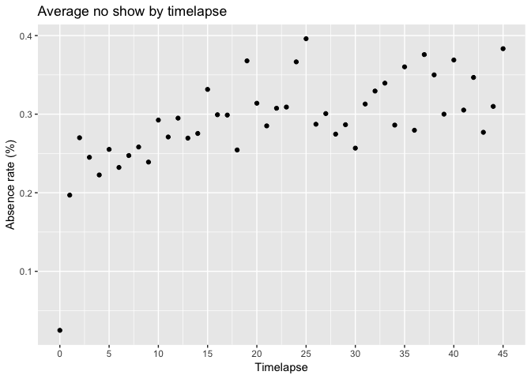
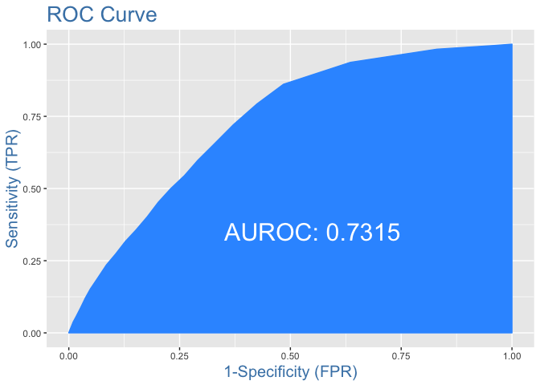

Medical no-show analytics
================

Introduction
============

This is an Exploratory Data Analysis for [Medical Appointment no shows](https://www.kaggle.com/joniarroba/noshowappointments).

This dataset collects information from 100k medical appointments in Brazil. I want to study the relationship between outcome variable, `noshow` with rest of the predictors to understand if there are any pattern that correlates with no-show rate.

**Conclusion** This dataset reinforce the conclusion of previous research paper that `Timelapse` and `Age` variable are most important in predicting no-show rate. Interesting fact is, Brazil health care system seem to penalize those who have assess to cellphone.

People who received sms notification tend to wait longer for see the doctor, longer time-lapse \[calculated from `Appointment day - Schedule day`\] are associated with higher no-show rate. Thus, even though an individual patient who received sms notification with a given timelapse day will tend to have lower probability of no-show rate than a patient who did not received sms notification with same wait, the fact that sms receivers on the whole tend to have higher wait time means that overall, sms receivers tend to have higher no show rate than non-sms receiver.

This is an important distinction for medical company who is trying to figure out what type of patient are more likely to no-show.

**A sms\_receiver is more likely to not show up than non-sms receiver if no information about number of wait day is available. However, that patient is more likely to show up than the same patient with same wait day but did not received sms notification**

Variables:

-   patientid
-   appointmentid
-   gender
-   schedule day
-   appointment day
-   age
-   neighborhood
-   scholarship
-   hipertension
-   diabetes
-   alcoholism
-   handcap
-   sms\_received: 1: patient receive sms notification, 0: no notification
-   noshow: outcome variable

The variables are all self-explanatory, most of them are binary coded, meaning for example, 1: they have hipertension, 0: they don't have hipertension.

Load libraries
--------------

``` r
library(tidyverse)
library(caret)
library(lubridate)
df <- read.csv("noshow.csv")
```

Data summary
------------

Data summary shows that we have about 20% no-shows. Few things we need to clean up: `age` has negative integer, `handcap` has more than 2 levels. We can also extract time lapse between appointment date and schedule date from the date.

``` r
summary(df)
```

    ##    PatientId         AppointmentID     Gender   
    ##  Min.   :3.922e+04   Min.   :5030230   F:71840  
    ##  1st Qu.:4.173e+12   1st Qu.:5640286   M:38687  
    ##  Median :3.173e+13   Median :5680573            
    ##  Mean   :1.475e+14   Mean   :5675305            
    ##  3rd Qu.:9.439e+13   3rd Qu.:5725524            
    ##  Max.   :1.000e+15   Max.   :5790484            
    ##                                                 
    ##                ScheduledDay                 AppointmentDay 
    ##  2016-05-06T07:09:54Z:    24   2016-06-06T00:00:00Z: 4692  
    ##  2016-05-06T07:09:53Z:    23   2016-05-16T00:00:00Z: 4613  
    ##  2016-04-25T17:17:46Z:    22   2016-05-09T00:00:00Z: 4520  
    ##  2016-04-25T17:18:27Z:    22   2016-05-30T00:00:00Z: 4514  
    ##  2016-04-25T17:17:23Z:    19   2016-06-08T00:00:00Z: 4479  
    ##  2016-04-25T17:19:03Z:    15   2016-05-11T00:00:00Z: 4474  
    ##  (Other)             :110402   (Other)             :83235  
    ##       Age                 Neighbourhood    Scholarship     
    ##  Min.   : -1.00   JARDIM CAMBURI : 7717   Min.   :0.00000  
    ##  1st Qu.: 18.00   MARIA ORTIZ    : 5805   1st Qu.:0.00000  
    ##  Median : 37.00   RESISTÊNCIA    : 4431   Median :0.00000  
    ##  Mean   : 37.09   JARDIM DA PENHA: 3877   Mean   :0.09827  
    ##  3rd Qu.: 55.00   ITARARÉ        : 3514   3rd Qu.:0.00000  
    ##  Max.   :115.00   CENTRO         : 3334   Max.   :1.00000  
    ##                   (Other)        :81849                    
    ##   Hipertension       Diabetes         Alcoholism        Handcap       
    ##  Min.   :0.0000   Min.   :0.00000   Min.   :0.0000   Min.   :0.00000  
    ##  1st Qu.:0.0000   1st Qu.:0.00000   1st Qu.:0.0000   1st Qu.:0.00000  
    ##  Median :0.0000   Median :0.00000   Median :0.0000   Median :0.00000  
    ##  Mean   :0.1972   Mean   :0.07186   Mean   :0.0304   Mean   :0.02225  
    ##  3rd Qu.:0.0000   3rd Qu.:0.00000   3rd Qu.:0.0000   3rd Qu.:0.00000  
    ##  Max.   :1.0000   Max.   :1.00000   Max.   :1.0000   Max.   :4.00000  
    ##                                                                       
    ##   SMS_received   No.show    
    ##  Min.   :0.000   No :88208  
    ##  1st Qu.:0.000   Yes:22319  
    ##  Median :0.000              
    ##  Mean   :0.321              
    ##  3rd Qu.:1.000              
    ##  Max.   :1.000              
    ## 

``` r
prop.table(table(df$No.show))
```

    ## 
    ##        No       Yes 
    ## 0.7980674 0.2019326

Data cleaning
=============

I changed the level names for `no-show` since the inital level of 'yes' and 'no' is a bit confusing, I changed it to `1` means did not show up, and `0` means did show up.

From the data summary, I see that age has some outliers. I will only focus on those from 0 - 83 years old, given 83 years old is within 2 sd from the mean. Also, `handcap` variable has 5 levels, I will move level 2-4 to level 1 so it means `1`: the patient is handicap, `0`: the patient is not handicap to stay consistent with the other health related variables. At last, I have created `timelapse` variable to calculate the difference in days between schedule day and appointment day, and I am only interested in timelapse &gt; 0.

``` r
colnames(df) <- tolower(colnames(df))
names(df)[names(df)=="no.show"] <- "noshow"

# make things less confusing:
levels(df$noshow) <- list("0" = "No", "1" = "Yes")

df$scheduledday <- as.character(df$scheduledday)
df$appointmentday <- as.character(df$appointmentday)

df$scheduledday <- as.Date(df$scheduledday, format = "%Y-%m-%d")
df$appointmentday <- as.Date(df$appointmentday, format = "%Y-%m-%d")

sd(df$age)
```

    ## [1] 23.1102

``` r
# create new variable: timelapse, get rid of negative timelapse
df <- df %>%
  mutate(timelapse = as.numeric(appointmentday - scheduledday)) %>%
  filter(timelapse >= 0,
         age >= 0, age <=83)

# let's change all other level of handcap to just 0 no handicap, 1 yes handicap
df$handcap <- ifelse(df$handcap>=1, 1, 0)
```

Patient who made 1 appointment
------------------------------

Given there are patients in this dataset that are one time patients vs repeated patients, it's necessary to separate the two for analysis.

There are 61255 unique patient after I did some basic cleaning

-   37229 patients made only one appointment
-   whereas 24026 patients made more than one appointment.

I only want to focus on unique patients who have made only one appointment. Also, the new variable, `timelapse` has some outlier, I will focus on timelapse within 3 months, which is 99.8% of the data.

``` r
length(unique(df$patientid))
```

    ## [1] 61255

``` r
length(unique(df$appointmentid))
```

    ## [1] 108775

``` r
single <- df %>%
  group_by(patientid) %>%
  select(everything()) %>%
  mutate(num_of_appt = n_distinct(appointmentid)) %>%
  filter(num_of_appt == 1)

single <- single[,-c(1,2,4,5,7,16)]
```

Given 95th percentile for time-lapse is 44 days, I will round it up to be exact 45 days for total of 1.5 month of maximum time-lapse between schedule date and appointment date to get rid of the outliers.

After cleaning, we have about 18% of no shows.

``` r
quantile(single$timelapse, c(.9, .95))
```

    ## 90% 95% 
    ##  34  44

``` r
single <- single %>%
  filter(timelapse <= 45)

single$noshow <- as.numeric(as.character(single$noshow))
prop.table(table(single$noshow))
```

    ## 
    ##         0         1 
    ## 0.8165624 0.1834376

Visualization
=============

Individual feature
------------------

**Numerical variable:**

-   `Age`: age is right skewed with multiple peak at every 20 years.
-   `Timelapse`: timelapse is right skewed with 36% of patients seeing the doctor the day they schedule the appointment

**Categorical variable:**

-   `Gender`: dataset consist of mostly female

``` r
single %>%
  keep(is.numeric) %>%
  gather() %>%
  ggplot(aes(value)) +
    facet_wrap(~key, scales='free') +
    geom_histogram()
```


``` r
ggplot(single, aes(gender))+ geom_bar()
```


Feature relation
----------------

Two variables I am mostly interested in are `age` and `timelapse`.

According to this research paper, [No-shows in appointment scheduling](https://www.sciencedirect.com/science/article/pii/S0168851018300459), main determinants of no-shows are high lead time, also adults of younger age and lower socioeconomic status are most likely to no-show. I want to see if this is also the case for this dataset.

Effect of timelapse on no-show
------------------------------

Average no-show rate is lowest for 0 days, about 2% and increase immediately to about 20% for 1 day wait and slowly increase as time lapse increase, the highest average no show is at about 40% with 25 days wait. This graph align with the research paper of 'longer lead time, more likely no-show'.

``` r
ggplot(single, aes(x = timelapse, y = noshow)) +
  geom_point(stat= 'summary', fun.y=mean) +
  labs(x='Timelapse', y='Absence rate (%)', 
       title = 'Average no show by timelapse') +
  scale_x_continuous(breaks=seq(0,45, 5))
```



Effect of age on no-show
------------------------

Average no-show rate are the highest at 22 years old at about 27%, lowest at 73 years old at about 8%. This graph align with my initial hypothesis that younger patients are more likely to not show up.

I was curious whether gender plays a role here, but looking at average no show breaking down by gender, I do not see anything different.

On the other hand, patients who are alcoholic display greater no-show rate than non-alcoholic, particular patients age 30 to 60.

``` r
ggplot(single, aes(x = age, y = noshow)) +
  geom_point(stat= 'summary', fun.y=mean) +
  labs(x='age', y='average no show %', title = 'Average no show by age') +
  scale_x_continuous(breaks=seq(0, 83, 5)) 
```


``` r
ggplot(single, aes(x = age, y = noshow, color = gender)) +
  geom_point(stat= 'summary', fun.y=mean) +
  labs(x='age', y='average no show %', 
       title = 'Average no show by age by gender') +
  scale_x_continuous(breaks=seq(0,83, 5))
```


``` r
ggplot(single, aes(x = age, y = noshow, color = factor(alcoholism))) +
  geom_point(stat= 'summary', fun.y=mean) +
  labs(x='age', y='average no show %', 
       title = 'Average no show by age by alcoholism') +
  scale_x_continuous(breaks=seq(0,83, 5))
```


Split data into train and test set:
===================================

``` r
set.seed(12)
split <- caTools::sample.split(single$noshow, SplitRatio = 0.70)
strain <- subset(single, split == TRUE)
stest <- subset(single, split == FALSE)
```

Calculate statistics
--------------------

Let's evaluate continous variables for skewness and transform skew predictor using BoxCox transformation.

From BoxCoxTrans() function, the estimated lambda to transform `timelapse` is 0.3, which is close to 0.5, so I will square timelapse for modeling.

``` r
# calculate skewness
library(e1071)

over <- strain %>%
  filter(timelapse>0)
BoxCoxTrans(over$timelapse)
```

    ## Box-Cox Transformation
    ## 
    ## 15789 data points used to estimate Lambda
    ## 
    ## Input data summary:
    ##    Min. 1st Qu.  Median    Mean 3rd Qu.    Max. 
    ##    1.00    4.00   12.00   14.61   23.00   45.00 
    ## 
    ## Largest/Smallest: 45 
    ## Sample Skewness: 0.665 
    ## 
    ## Estimated Lambda: 0.3

Model building
==============

Logistic regression
-------------------

Model with lowest residual deviance is model 3 with square root transformation for `timelapse`. However, one major difference is, coefficient for `sms_received` is negative when sqrt(timelapse) is included, as oppose to positive as model 1 indicated.

Initially, positive coefficient for `sms_received` indicate that a patient is more likely to no-show if they received sms notification. However, looking at `sms_received vs timelapse` plot shows that, people who received sms notification tend to have to wait longer for see the doctor, which tend to be associated with higher no-show rate. Thus, even though an individual patient who received sms notification with a given timelapse day will tend to have lower probability of no-show rate than a patient who did not received sms notification with same wait, the fact that sms receivers on the whole tend to have higher wait time means that overall, sms receivers tend to have higher no show rate than non-sms receiver.

This is an important distinction for medical company who is trying to figure out what type of patient are more likely to no-show. A sms\_receiver is more likely to not show up than non-sms receiver if no information about number of wait day is available. However, that patient is more likely to show up than the same patient with same wait day but did not received sms notification.

``` r
m1 <- glm(noshow~., data=strain, family="binomial")
summary(m1)
```

    ## 
    ## Call:
    ## glm(formula = noshow ~ ., family = "binomial", data = strain)
    ## 
    ## Deviance Residuals: 
    ##     Min       1Q   Median       3Q      Max  
    ## -1.3882  -0.6276  -0.5224  -0.4402   2.3059  
    ## 
    ## Coefficients:
    ##                Estimate Std. Error z value Pr(>|z|)    
    ## (Intercept)  -1.8068636  0.0403214 -44.812  < 2e-16 ***
    ## genderM       0.0277920  0.0354463   0.784   0.4330    
    ## age          -0.0074125  0.0008813  -8.411  < 2e-16 ***
    ## scholarship   0.1400187  0.0577438   2.425   0.0153 *  
    ## hipertension -0.1393233  0.0571994  -2.436   0.0149 *  
    ## diabetes      0.0779433  0.0813584   0.958   0.3381    
    ## alcoholism    0.5047662  0.1058542   4.769 1.86e-06 ***
    ## handcap      -0.0542295  0.1463023  -0.371   0.7109    
    ## sms_received  0.2226334  0.0379594   5.865 4.49e-09 ***
    ## timelapse     0.0417236  0.0014268  29.244  < 2e-16 ***
    ## ---
    ## Signif. codes:  0 '***' 0.001 '**' 0.01 '*' 0.05 '.' 0.1 ' ' 1
    ## 
    ## (Dispersion parameter for binomial family taken to be 1)
    ## 
    ##     Null deviance: 23672  on 24834  degrees of freedom
    ## Residual deviance: 22272  on 24825  degrees of freedom
    ## AIC: 22292
    ## 
    ## Number of Fisher Scoring iterations: 4

``` r
m2 <- update(m1, .~.-diabetes-handcap-gender)
#summary(m2)

m3 <- update(m2, .~.-timelapse+sqrt(timelapse))
summary(m3)
```

    ## 
    ## Call:
    ## glm(formula = noshow ~ age + scholarship + hipertension + alcoholism + 
    ##     sms_received + sqrt(timelapse), family = "binomial", data = strain)
    ## 
    ## Deviance Residuals: 
    ##     Min       1Q   Median       3Q      Max  
    ## -1.4509  -0.6527  -0.4629  -0.3725   2.4375  
    ## 
    ## Coefficients:
    ##                   Estimate Std. Error z value Pr(>|z|)    
    ## (Intercept)     -2.1384035  0.0404171 -52.908  < 2e-16 ***
    ## age             -0.0082443  0.0008836  -9.331  < 2e-16 ***
    ## scholarship      0.1470126  0.0583360   2.520   0.0117 *  
    ## hipertension    -0.1200503  0.0545451  -2.201   0.0277 *  
    ## alcoholism       0.5463006  0.1071474   5.099 3.42e-07 ***
    ## sms_received    -0.0995320  0.0390900  -2.546   0.0109 *  
    ## sqrt(timelapse)  0.3585024  0.0091353  39.244  < 2e-16 ***
    ## ---
    ## Signif. codes:  0 '***' 0.001 '**' 0.01 '*' 0.05 '.' 0.1 ' ' 1
    ## 
    ## (Dispersion parameter for binomial family taken to be 1)
    ## 
    ##     Null deviance: 23672  on 24834  degrees of freedom
    ## Residual deviance: 21545  on 24828  degrees of freedom
    ## AIC: 21559
    ## 
    ## Number of Fisher Scoring iterations: 4

``` r
cor(strain$timelapse, strain$sms_received)
```

    ## [1] 0.4645512

``` r
ggplot(strain, aes(factor(sms_received), timelapse,
                   fill=factor(sms_received)))+geom_boxplot()
```


Variable Importance
-------------------

I want to understand which variable is most influential in predicting the response variable. `Timelapse` is the most important variable in predicting no-show, follow by `age`.

``` r
varImp(m3)
```

    ##                   Overall
    ## age              9.330799
    ## scholarship      2.520102
    ## hipertension     2.200938
    ## alcoholism       5.098591
    ## sms_received     2.546228
    ## sqrt(timelapse) 39.243790

Make predictions
----------------

``` r
strain$pred <- predict(m3, newdata=strain, type="response")
stest$pred <- predict(m3, newdata=stest, type="response")
```

ROC AUC
-------

ROC curve shows the sensitivity of the classifier by plotting the rate of true positive to rate of false positive. It shows you how many correct positive classification can be gained as you allow for more false positive.

Perfect classifier that makes no mistake would hit true positive rate of 100% immediately, without incurring any false positive- this won't happen in practice.

AUC is one way to summarize the ROC curve into a single number, so it can be compared easily and automatically. Higher the AUC the better.

**Model 2** has an AUC of .7315.

``` r
library(InformationValue)
```

    ## 
    ## Attaching package: 'InformationValue'

    ## The following objects are masked from 'package:caret':
    ## 
    ##     confusionMatrix, precision, sensitivity, specificity

``` r
plotROC(stest$noshow, stest$pred)
```



Conclusion
==========

This dataset reinforce the conclusion of previous research paper that `Timelapse` and `Age` variable are important in predicting no-show rate. Interesting fact is, Brazil health care system seem to penalize those who have assess to cellphone, "rich people", given they have to wait longer to see a doctor.

Variable that would be incredibly useful to have:

-   Cost of appointment
-   What type of appointment it is
-   Travel time of the patient from his/her home/work to hospital \[commute time\] All of the above would be incredibly useful in understanding patient's no-show rate.

One thing I did not understand when I first look at timelapse variable was why would anyone wait so long for an appointment. As I read more into healthcare in Brazil, I realized that Brazil offered free public healthcare service, thus government funded hospitals and clinics are often crowded which in turn increased waiting time for public hospital. It would be helpful to know whether the patient has public or private health insurance, this will also help us better predict no-show rate.

Also, initially I thought scholarship would be an important variable in explaining no-show rate, but given Brazil's free healthcare service, does it really matter if a patient is scholarship recipient or not?

At last, logistic regression may not be the best model to use in this case, next thing I would try is either random forest.
